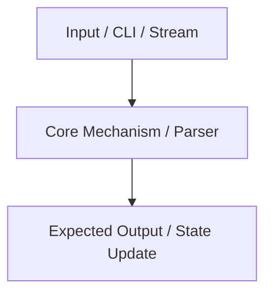

# Lesson Format (`NNNN-<dash-case-name>.md`)

Lessons live in `Teach/<Topic>/Lessons/` and use four-digit zero-padded sequential numbering: `0001-slug.md`, `0002-slug.md`, etc.

A lesson is a step-by-step challenge modeled after [Coding Challenges](https://codingchallenges.fyi/challenges/intro). It provides clear domain background, mental models, and sequential implementation steps (Step Zero: Setup, Step One, Step Two, etc.) alongside concrete verification test commands and expected outputs — **with zero solution code**. The learner writes all implementation code themselves.

## Template

```md
---
title: "Lesson {NNNN}: {Challenge Title}"
type: lesson
topic: "{Topic}"
created: YYYY-MM-DD
updated: YYYY-MM-DD
tags:
  - teach/{topic-slug}
  - lesson
aliases:
  - "{Challenge Title}"
---

[[../{Topic}|← {Topic} MOC]] · [[../MISSION|🎯 Mission]] · [[../GLOSSARY|📖 Glossary]]

# Lesson {NNNN}: {Challenge Title}

> [!NOTE] Challenge Goal
> By the end of this challenge, you will build and verify: **{One specific, observable capability or feature}**.

---

## 1. Challenge & Background

{2-3 paragraphs explaining the challenge, practical utility, and background concepts. Ground definitions by linking to [[../GLOSSARY#{Term}|{Term}]] and relevant vault notes like [[Coding/{Topic}/{Concept}|{Concept}]]. Link to specifications, RFCs, or man pages where applicable.}

> [!TIP] Mental Model
> {A crisp 1-2 sentence mental model or rule of thumb to anchor understanding.}

---

## 2. Mental Model & Architecture



> [!WARNING] Edge Case & Common Trap
> {A frequent pitfall, boundary case, byte ordering gotcha, or anti-pattern to avoid.}

---

## 3. Step Zero: Environment & Test Setup

Set up your development workspace, test files, or sample fixtures needed to verify your solution:

```bash
# Example setup command / generating test fixture
```

---

## 4. Challenge Steps

### Step One: {First Minimal Working Milestone}

**Goal**: {Concise description of what feature, flag, or behavior to implement.}

**How to Test**:
```bash
> {your_command} {args} test_input
```

**Expected Output**:
```text
{exact expected output}
```

If your output matches, congratulations! On to Step Two.

---

### Step Two: {Next Incremental Feature / Option}

**Goal**: {Add the next flag, parse the next data structure, or handle secondary behavior.}

**How to Test**:
```bash
> {your_command} {args} test_input
```

**Expected Output**:
```text
{exact expected output}
```

---

### Step Three: {Combined / Default Behavior}

**Goal**: {Combine features, handle default configurations, or support multiple inputs.}

**How to Test**:
```bash
> {your_command} test_input
```

**Expected Output**:
```text
{exact expected output}
```

---

### The Final Step: {Streams / Edge Cases / Robustness}

**Goal**: {Handle standard input streams (`stdin` / pipes), error handling, or edge cases.}

**How to Test**:
```bash
> cat test_input | {your_command}
```

**Expected Output**:
```text
{exact expected output}
```

---

## 5. Verification Checklist

- [ ] Step Zero: Environment and test fixtures prepared
- [ ] Step One: {Milestone 1} verified with expected output
- [ ] Step Two: {Milestone 2} verified with expected output
- [ ] Step Three: {Milestone 3} verified with expected output
- [ ] Final Step: {Final capability} verified with expected output

---

## 6. Primary Sources & Further Reading

- [Canonical Specification / RFC / Documentation: {Title}]({URL}) — {1-sentence explanation of why this is the authoritative reference.}

---

## 💬 Next Steps
Run the test commands against your implementation. If you need code snippets or hints, ask for them! When you have verified all steps, declare completion to record your milestone in [[../Learning Records/|Learning Records]] and unlock the next lesson.

---
[[{Previous-Lesson-Slug}|← Previous Lesson]] · [[../{Topic}|Curriculum Hub]] · [[{Next-Lesson-Slug}|Next Lesson →]]
```

## Rules

- **Zero-Code Policy**: Never output implementation code, boilerplate solutions, or function bodies in lesson plans. Only output test commands, inputs, and expected outputs. If the learner needs code, they will explicitly ask for it in chat.
- **Step-by-Step Challenge Format**: Follow the [Coding Challenges](https://codingchallenges.fyi/challenges/intro) layout: Step Zero (setup), followed by incremental steps (Step One, Step Two, etc.) leading to a complete working feature.
- **Concrete Verification Steps**: Every single step MUST contain exact instructions on how to test the implementation, including the command to run and the expected terminal/test output.
- **Tight Scope**: One cohesive challenge per lesson, completable in sequential 5–10 minute milestones.
- **Wikilink Extensively**: Cross-link terms to `[[../GLOSSARY#Term]]`, related reference sheets in `[[../Reference/]]`, and existing vault notes.
- **Format Integrity**: Clean Obsidian callouts and standard YAML frontmatter on every lesson.

