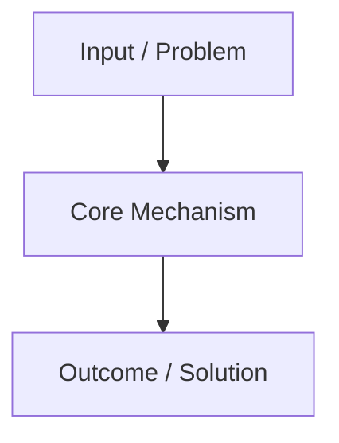

# Lesson Format (`NNNN-<dash-case-name>.md`)

Lessons live in `Teach/<Topic>/Lessons/` and use four-digit zero-padded sequential numbering: `0001-slug.md`, `0002-slug.md`, etc.

A lesson is a single self-contained Obsidian Markdown document designed for high legibility, active recall, and tight feedback.

## Template

```md
---
title: "Lesson {NNNN}: {Lesson Title}"
type: lesson
topic: "{Topic}"
created: YYYY-MM-DD
updated: YYYY-MM-DD
tags:
  - teach/{topic-slug}
  - lesson
aliases:
  - "{Lesson Title}"
---

[[../{Topic}|← {Topic} MOC]] · [[../MISSION|🎯 Mission]] · [[../GLOSSARY|📖 Glossary]]

# Lesson {NNNN}: {Lesson Title}

> [!NOTE] Tangible Win
> By the end of this lesson, you will be able to: **{One specific, observable capability}**.

---

## 1. Core Concept

{2-4 paragraphs explaining the concept clearly. Ground definitions by linking to [[../GLOSSARY#{Term}|{Term}]] and relevant vault notes like [[Coding/{Topic}/{Concept}|{Concept}]].}

> [!TIP] Mental Model / Heuristic
> {A crisp 1-2 sentence mental model or rule of thumb to anchor understanding.}

---

## 2. Mental Model & Architecture



---

## 3. Practical Mechanics

{Syntax-highlighted code block or concrete step-by-step example.}

```rust
// Example code demonstrating the pattern
fn main() {
    // Clear comments explaining key lines
}
```

> [!WARNING] Common Trap
> {A frequent pitfall, anti-pattern, or compiler error learners encounter with this pattern.}

---

## 4. Interactive Retrieval & Practice

> [!QUESTION] Active Recall: Check Your Understanding
> {A crisp question testing the core mechanism without visual clues.}

> [!FAQ]- Solution (Click to reveal)
> **Answer**: {Direct, unambiguous answer and explanation.}

### Hands-On Exercise
- [ ] {Step 1: Concrete task to perform}
- [ ] {Step 2: Verification or test case}
- [ ] {Step 3: Self-assessment check}

---

## 5. Primary Source & Further Reading

- [Primary Source: {Title} by {Author}]({URL}) — {1-sentence explanation of why this is the highest-trust source on this concept.}

---

## 💬 Next Steps
Ask the agent any questions that remain unclear, or declare when you have completed the exercise to generate the next lesson and record your milestone in [[../Learning Records/|Learning Records]].

---
[[{Previous-Lesson-Slug}|← Previous Lesson]] · [[../{Topic}|Curriculum Hub]] · [[{Next-Lesson-Slug}|Next Lesson →]]
```

## Rules

- **Tight Scope**: One single skill or concept per lesson. Completable in 5–10 minutes.
- **Wikilink Extensively**: Cross-link terms to `[[../GLOSSARY#Term]]`, related reference sheets in `[[../Reference/]]`, and existing vault notes.
- **Collapsible Spoilers**: Always wrap quiz solutions in `> [!FAQ]- Solution (Click to reveal)` so the learner can test retrieval before peeking.
- **High-Trust Citations**: Include at least one verified primary source per lesson.
- **Format Integrity**: Clean Obsidian callouts and standard YAML frontmatter on every lesson.
