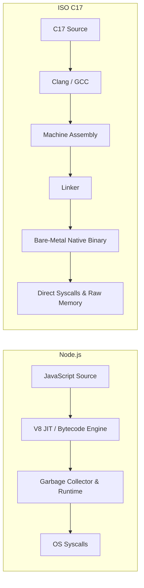
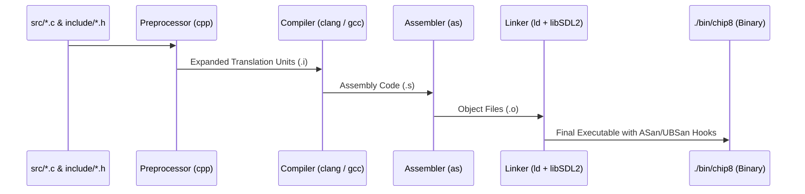

[[Teach/C17/C17|← C17 MOC]] · [[Teach/C17/MISSION|🎯 Mission]] · [[Teach/C17/GLOSSARY|📖 Glossary]] · [[Teach/C17/RESOURCES|📚 Resources]]

# Lesson 0001: ISO C17 Standards, Compiler Diagnostics & CMake with SDL2

> [!NOTE] Tangible Win
> By the end of this lesson, you will be able to: **Equip your `chip-8-emu` codebase with a production `CMakeLists.txt` that links SDL2, enforces strict ISO C17 diagnostics (`-Wall -Wextra -Wpedantic -Wstrict-prototypes`), exports `compile_commands.json` for editor LSP, and runs with live AddressSanitizer (ASan) & UndefinedBehaviorSanitizer (UBSan).**

---

## 1. What is ISO C17?

The C standard evolved through **C89/C90** → **C99** → **C11** → **C17** (ISO/IEC 9899:2018) → **C23**.

**C17 is the bug-fix and refinement release of C11**. It introduced no new language features, but resolved over 40 technical defect reports (DRs). In modern systems programming, **C17 is the gold standard for production codebases** because it is universally supported across GCC, Clang, and MSVC without experimental volatility.

The standard version macro in C17 is:
```c
#if __STDC_VERSION__ != 201710L
#error "This codebase requires an ISO C17 conforming compiler!"
#endif
```

---

## 2. The Systems Mental Model vs Node.js / Rust / Go

Coming from Node.js (V8) and Rust/Go:



- **In Node.js**: Memory is abstracted behind garbage collection (V8). You cannot manage cache lines, alignment, or raw stack frames.
- **In Rust/Go**: The compiler prevents invalid memory operations at compile time or via runtime garbage collection.
- **In C17**: You have direct control over hardware and memory layout. In your [[Emulation/CHIP-8|CHIP-8 emulator]], `Memory.memory[4096]` represents the physical RAM directly. If you index beyond `4095`, C will not stop you—it will trigger [[Teach/C17/GLOSSARY#Undefined Behavior (UB)|Undefined Behavior (UB)]].

> [!TIP] The Function Prototype Trap in C
> In Node.js, Go, Rust, and C++, `void foo()` declares a function taking **zero** arguments.
> In C, `void foo()` declares a function taking an **unspecified number of arguments** (legacy C89 artifact).
> In modern C, you must **always** write `void foo(void)` to declare a zero-argument function. We enforce `-Wstrict-prototypes` to catch this error automatically. See [[Books/C/Advanced C Programming Course/Storage Classes|C Storage Classes]] and [[Grill/C Systems Programming|C Systems Diagnostic]].

---

## 3. The Modern C17 Compilation Pipeline



To catch errors early in this pipeline, we equip Clang/GCC with two critical dynamic instrumentation tools:
1. **[[Teach/C17/GLOSSARY#AddressSanitizer (ASan)|AddressSanitizer (ASan)]]**: Detects buffer overflows, stack/heap out-of-bounds access, and memory leaks.
2. **[[Teach/C17/GLOSSARY#UndefinedBehaviorSanitizer (UBSan)|UndefinedBehaviorSanitizer (UBSan)]]**: Detects integer overflows, null-pointer dereferences, and misalignment at runtime.

---

## 4. Production `CMakeLists.txt` for `chip-8-emu/c`

Place this `CMakeLists.txt` directly in `/Users/morfes/projects/chip-8-emu/c/CMakeLists.txt` (derived from [[Teach/C17/Reference/Modern C17 Toolchain and CMake|Toolchain Reference]]):

```cmake
cmake_minimum_required(VERSION 3.20)
project(chip8_emu C)

# 1. Enforce ISO C17 Standard strictly (disable non-standard compiler extensions)
set(CMAKE_C_STANDARD 17)
set(CMAKE_C_STANDARD_REQUIRED ON)
set(CMAKE_C_EXTENSIONS OFF)

# 2. Export compile_commands.json for clangd / Neovim / VS Code LSP
set(CMAKE_EXPORT_COMPILE_COMMANDS ON)

# 3. Find SDL2 dependency across macOS (Homebrew) and Linux
find_package(SDL2 REQUIRED)

# 4. Include project headers
include_directories(include ${SDL2_INCLUDE_DIRS})

# 5. Gather source files
file(GLOB_RECURSE SOURCES "src/*.c")

# 6. Define Target Executable
add_executable(chip8 ${SOURCES})

# 7. Link SDL2
target_link_libraries(chip8 PRIVATE ${SDL2_LIBRARIES})

# 8. Professional Diagnostic Warnings
target_compile_options(chip8 PRIVATE
    -Wall
    -Wextra
    -Wpedantic
    -Wshadow
    -Wconversion
    -Wdouble-promotion
    -Wformat=2
    -Wundef
    -Wstrict-prototypes
    -Wmissing-prototypes
)

# 9. Dynamic Sanitizers (AddressSanitizer & UndefinedBehaviorSanitizer in Debug Mode)
option(ENABLE_SANITIZERS "Enable ASan and UBSan in Debug builds" ON)
if(ENABLE_SANITIZERS AND CMAKE_BUILD_TYPE MATCHES "Debug")
    target_compile_options(chip8 PRIVATE 
        -fsanitize=address,undefined 
        -fno-omit-frame-pointer 
        -g
    )
    target_link_options(chip8 PRIVATE 
        -fsanitize=address,undefined
    )
endif()
```

---

## 5. Interactive Retrieval & Practice

> [!QUESTION] Active Recall 1
> Why is `Chip8 new_chip8()` in C different from `Chip8 new_chip8(void)`, and what compiler flag enforces the latter?

> [!FAQ]- Solution (Click to reveal)
> `new_chip8()` in C allows passing any number of arbitrary arguments at call sites because empty parameter lists mean *unspecified arguments* in C. `new_chip8(void)` guarantees exactly zero arguments. The compiler flag `-Wstrict-prototypes` enforces this.

---

> [!QUESTION] Active Recall 2
> What is the runtime impact of compiling with `-fsanitize=address,undefined` during emulator development?

> [!FAQ]- Solution (Click to reveal)
> It instruments every memory read/write and arithmetic operation. If the CHIP-8 interpreter tries to write outside `memory.memory[4096]`, read past the screen buffer `screen[64][32]`, or execute signed integer overflow, the program instantly halts with an exact stack trace and memory address report rather than silently corrupting memory.

---

### 🛠️ Hands-On Exercise on your CHIP-8 Repo

- [ ] Create `/Users/morfes/projects/chip-8-emu/c/CMakeLists.txt` with the configuration above.
- [ ] Build in Debug mode:
  ```bash
  cd /Users/morfes/projects/chip-8-emu/c
  cmake -B build -DCMAKE_BUILD_TYPE=Debug
  cmake --build build
  ./build/chip8
  ```
- [ ] Observe the strict compiler diagnostic feedback on any missing prototypes or conversions.

---

## 6. Primary Source

- [ISO/IEC 9899:2018 Specification (C17 Committee Draft N2176)](https://www.open-std.org/jtc1/sc22/wg14/www/docs/n2176.pdf) — Section 6.7.6.3 (Function declarators and prototypes).

---

## 💬 Next Steps
Try running the CMake build on your `chip-8-emu/c` directory! Once configured, we will proceed to **[[Teach/C17/Lessons/0002-binary-file-io-and-rom-loading|Lesson 0002: Safe Binary File I/O & ROM Loading into Memory at 0x200]]**!

---
[[Teach/C17/C17|← C17 MOC]] · [[Teach/C17/Lessons/0002-binary-file-io-and-rom-loading|Lesson 0002: Binary File I/O & ROM Loading →]]
