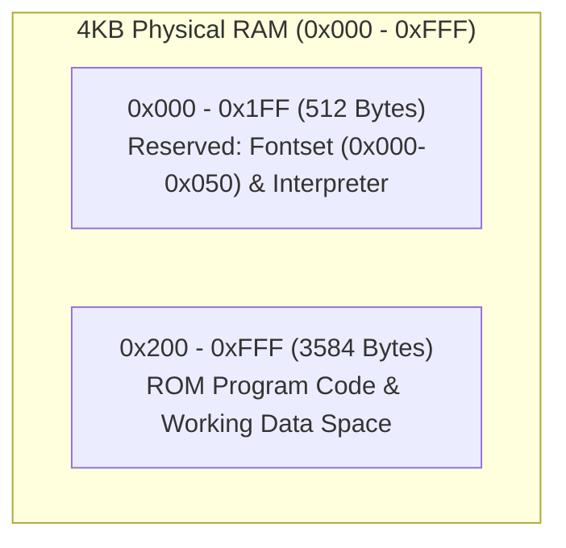
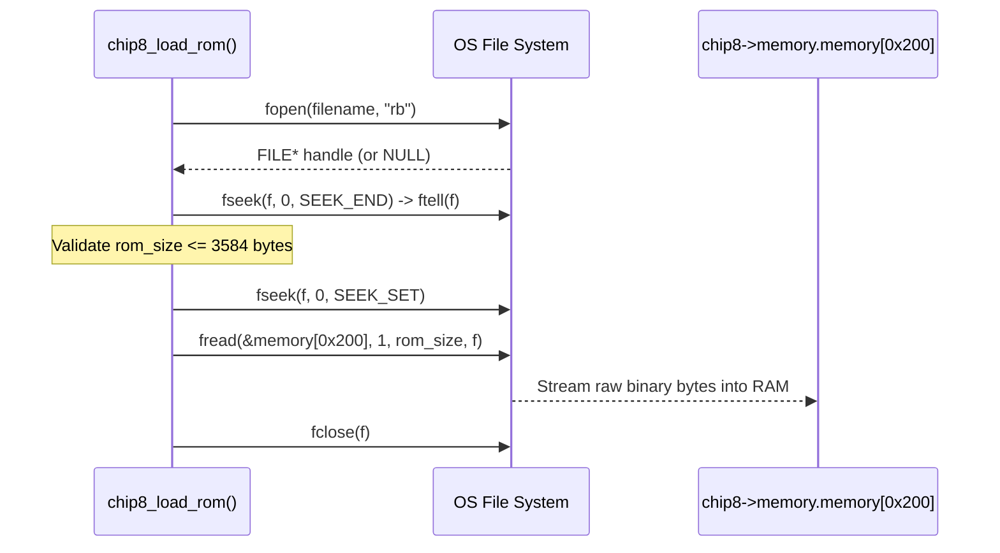

[[../C17|← C17 MOC]] · [[../MISSION|🎯 Mission]] · [[../GLOSSARY|📖 Glossary]]

# Lesson 0002: Safe Binary File I/O & ROM Loading into Memory at 0x200

> [!NOTE] Tangible Win
> By the end of this lesson, you will be able to: **Implement a robust, memory-safe binary ROM file loader for your CHIP-8 emulator that validates file presence, ensures ROM size fits within RAM boundaries (max 3,584 bytes), and loads bytecode starting at address `0x200` using standard C17 file streams.**

---

## 1. The CHIP-8 Memory Architecture

CHIP-8 systems address 4,096 bytes (4 KB) of RAM (`0x000` to `0xFFF`):



- **`0x000` to `0x1FF`**: Historically held the CHIP-8 interpreter itself on the COSMAC VIP and Telmac 1800. In our emulator, the built-in 80-byte **hexadecimal font set** lives in this region (`0x0000` to `0x0050`).
- **`0x200` (`512`)**: The standard entry point. **All CHIP-8 ROMs must be loaded starting at address `0x200`**, and the Program Counter (`PC`) starts at `0x200`.

---

## 2. Low-Level Binary File I/O in C17

Reading binary data in C differs significantly from high-level `fs.readFileSync` in Node.js. You manage the OS file handle stream directly:



### The Three Critical Invariants of Binary File I/O:

1. **Always use `"rb"` (Binary Mode)**:
   In C, opening with `"r"` enables text-mode translation (e.g. carriage returns `\r\n` converted to `\n` on certain platforms), which will silently corrupt binary executable bytes. Always specify `"rb"`.
2. **Bounds Checking Against Buffer Overflow**:
   A corrupted or malicious ROM larger than `4096 - 512 = 3584` bytes will overflow `memory.memory[4096]` and trigger [[../GLOSSARY#Undefined Behavior (UB)|Undefined Behavior (UB)]]. We must calculate the file size and reject oversized ROMs before reading.
3. **Always Check Return Values**:
   `fopen` returns `NULL` if the file doesn't exist or permissions fail. `fread` returns the number of items successfully read.

---

## 3. Implementation: Adding ROM Loading to `chip8.h` and `chip8.c`

### Update `include/config.h`
Ensure your constants define the program start address:
```c
#ifndef CONFIG_H
#define CONFIG_H

#define CHIP8_MEMORY_SIZE 4096
#define CHIP8_PROGRAM_LOAD_ADDRESS 0x200
#define CHIP8_MAX_ROM_SIZE (CHIP8_MEMORY_SIZE - CHIP8_PROGRAM_LOAD_ADDRESS)

#define CHIP8_WIDTH 64
#define CHIP8_HEIGHT 32
#define WINDOW_SCALE 10
#define WINDOW_TITLE "CHIP-8 Emulator"

#endif
```

### Update `include/chip8.h`
Add the function prototype with defensive error returning (`bool`):
```c
#ifndef CHIP8_H
#define CHIP8_H

#include <stdbool.h>
#include "config.h"
#include "memory.h"
#include "registers.h"
#include "stack.h"
#include "keyboard.h"
#include "screen.h"

typedef struct Chip8 {
    Memory memory;
    Registers registers;
    Stack stack;
    Keyboard keyboard;
    Screen screen;
} Chip8;

Chip8 new_chip8(void);
bool chip8_load_rom(Chip8 *chip8, const char *filepath);

#endif
```

### Implement in `src/chip8.c`
```c
#include <stdio.h>
#include <stdbool.h>
#include "chip8.h"

bool chip8_load_rom(Chip8 *chip8, const char *filepath) {
    if (chip8 == NULL || filepath == NULL) {
        return false;
    }

    FILE *file = fopen(filepath, "rb");
    if (!file) {
        fprintf(stderr, "error: could not open rom file '%s'\n", filepath);
        return false;
    }

    // Determine file size
    if (fseek(file, 0, SEEK_END) != 0) {
        fclose(file);
        return false;
    }

    long file_size = ftell(file);
    if (file_size <= 0) {
        fprintf(stderr, "Error: ROM file '%s' is empty or invalid.\n", filepath);
        fclose(file);
        return false;
    }

    if (file_size > CHIP8_MAX_ROM_SIZE) {
        fprintf(stderr, "Error: ROM size (%ld bytes) exceeds maximum allowable RAM (%d bytes).\n", 
                file_size, CHIP8_MAX_ROM_SIZE);
        fclose(file);
        return false;
    }

    // Rewind back to beginning of file
    rewind(file);

    // Read directly into memory starting at 0x200
    size_t bytes_read = fread(&chip8->memory.memory[CHIP8_PROGRAM_LOAD_ADDRESS], 
                              sizeof(uint8_t), 
                              (size_t)file_size, 
                              file);

    fclose(file);

    if (bytes_read != (size_t)file_size) {
        fprintf(stderr, "Error: Failed to read entire ROM into memory.\n");
        return false;
    }

    printf("Successfully loaded ROM '%s' (%zu bytes) at 0x%X\n", 
           filepath, bytes_read, CHIP8_PROGRAM_LOAD_ADDRESS);
    return true;
}
```

---

## 4. Interactive Retrieval & Practice

> [!QUESTION] Active Recall 1
> Why is `fseek(f, 0, SEEK_END)` followed by `ftell(f)` the standard C idiom for checking file size, and why must you call `rewind(f)` or `fseek(f, 0, SEEK_SET)` before calling `fread`?

> [!FAQ]- Solution (Click to reveal)
> `fseek(..., SEEK_END)` moves the file position indicator to the end of the file, allowing `ftell()` to report the total byte offset. If you do not rewind back to `0`, `fread()` would attempt to read from the end of the file and read 0 bytes.

---

> [!QUESTION] Active Recall 2
> Why is `sizeof(uint8_t)` guaranteed to be 1 byte, and why do we pass `(size_t)file_size` when calling `fread`?

> [!FAQ]- Solution (Click to reveal)
> In C, `uint8_t` (from `<stdint.h>`) is an exact 8-bit unsigned integer type of size 1. `ftell` returns a signed `long` (which can be negative on error), whereas `fread` expects `size_t` (an unsigned integer type representing object sizes). Explicitly verifying `file_size > 0` before casting prevents signed-to-unsigned conversion bugs.

---

### 🛠️ Hands-On Exercise on your CHIP-8 Repo

- [ ] Add `chip8_load_rom` to `include/chip8.h` and `src/chip8.c`.
- [ ] Update `src/main.c` to accept a ROM path from `argv[1]`:
  ```c
  if (argc < 2) {
      fprintf(stderr, "Usage: %s <path-to-rom>\n", argv[0]);
      return 1;
  }
  if (!chip8_load_rom(&chip8, argv[1])) {
      return 1;
  }
  ```
- [ ] Rebuild with CMake:
  ```bash
  cmake --build build
  ```
- [ ] Test passing a test ROM file or a dummy binary file to verify successful loading into RAM!

---

## 5. Primary Source

- [SEI CERT C Coding Standard: FIO19-C](https://wiki.sei.cmu.edu/confluence/display/c/FIO19-C.+Do+not+use+fseek%28%29+and+ftell%28%29+to+compute+the+size+of+a+regular+file+in+untrusted+environments) — Secure file size validation and buffer limits.

---

## 💬 Next Steps
Once your ROM loader is verified, let me know! Next, we will tackle **[[../Lessons/0003-bitwise-operations-and-opcode-fetching|Lesson 0003: 16-Bit Big-Endian Opcode Fetching & Bitwise Masking]]**!

---
[[0001-c17-standards-and-modern-toolchain|← Previous Lesson]] · [[../C17|Curriculum Hub]] · [[0003-bitwise-operations-and-opcode-fetching|Lesson 0003: Opcode Fetching & Bitwise Masking →]]
