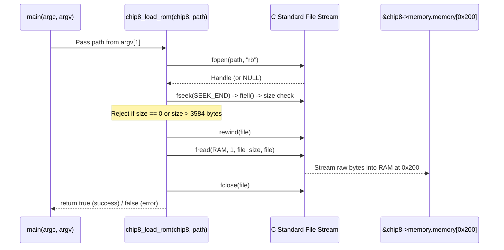

[[Teach/C17/C17|← C17 MOC]] · [[Teach/C17/MISSION|🎯 Mission]] · [[Teach/C17/GLOSSARY|📖 Glossary]] · [[Teach/C17/RESOURCES|📚 Resources]]

# Lesson 0002: Safe Binary File I/O & ROM Loading into Memory at 0x200

> [!NOTE] Challenge Goal
> By the end of this challenge, you will build and verify: **A robust, memory-safe binary ROM file loader for your CHIP-8 emulator that validates file presence, ensures ROM size fits within RAM boundaries (max 3,584 bytes), and loads bytecode starting at address `0x200` using standard C17 file streams.**

---

## 1. Challenge & Background

In [[Emulation/CHIP-8#Memory|CHIP-8 Architecture]], the virtual machine addresses 4,096 bytes (4 KB) of RAM (`0x000` to `0xFFF`). Memory from `0x000` to `0x1FF` (512 bytes) is reserved for the built-in font set (`0x000`-`0x050`) and legacy interpreter memory. All CHIP-8 executable ROMs must be loaded starting at address **`0x200` (512 decimal)**, and the Program Counter (`PC`) begins execution at `0x200`.

Reading binary executables in C differs fundamentally from high-level environments like Node.js (`fs.readFileSync`). In C17, you operate raw file stream handles (`FILE*`) directly against physical memory buffers. An oversized ROM or unverified file read can cause buffer overflow and trigger [[Teach/C17/GLOSSARY#Undefined Behavior (UB)|Undefined Behavior (UB)]]. Following [[Thoughts/Defensive Programming|Defensive Programming]] and [[Teach/C17/Reference/Standard IO and Binary File Streams|Standard I/O Conventions]], we must validate all boundaries before reading.

> [!TIP] Mental Model
> Treat the ROM file as an untrusted stream of raw bytes. Verify stream presence with `fopen("rb")`, inspect byte size via `fseek(SEEK_END)` + `ftell()`, enforce the strict ceiling `file_size <= 3584`, `rewind()`, and transfer into `memory[0x200]` with `fread()`.

---

## 2. Architecture & Memory Layout

```mermaid
graph TD
    subgraph RAM["CHIP-8 4KB Physical RAM (0x000 - 0xFFF)"]
        A["0x000 - 0x1FF (512 Bytes)<br/>Reserved: Hex Fontset (0x000-0x050)"]
        B["0x200 - 0xFFF (3584 Bytes)<br/>ROM Program Code & Dynamic RAM"]
    end

    ROM[Binary ROM on Disk] -->|fread into &memory[0x200]| B
```



> [!WARNING] Critical Invariants
> 1. **Binary Mode Only (`"rb"`)**: Never open in text mode (`"r"`), which converts newline bytes and silently corrupts opcodes.
> 2. **Max ROM Limit (3,584 Bytes)**: Total RAM is 4,096 bytes. `4096 - 0x200 (512) = 3584` bytes. Any byte beyond 3,584 overflows RAM.
> 3. **Stream Cleanup**: Every opened `FILE*` must be closed with `fclose()` across both success and early-return error paths.

---

## 3. Step Zero: Environment & Test Fixture Setup

Generate test binary fixtures with varying sizes (valid, empty, and oversized) in your repo to verify each validation gate:

```bash
cd /Users/morfes/projects/chip-8-emu/c
mkdir -p tests/fixtures

# 1. Create a valid dummy ROM (16 bytes)
printf '\x12\x00\x60\x00\x61\x00\x70\x01\xA2\x50\xD0\x15\x12\x00\x00\x00' > tests/fixtures/valid.ch8

# 2. Create an empty ROM (0 bytes)
touch tests/fixtures/empty.ch8

# 3. Create an oversized ROM (4000 bytes - exceeds 3584 bytes limit)
dd if=/dev/zero of=tests/fixtures/oversized.ch8 bs=1 count=4000 2>/dev/null
```

---

## 4. Challenge Steps

### Step One: Define Memory & ROM Boundaries in Configuration

**Goal**: Ensure your configuration defines the memory architecture constants:
- `CHIP8_MEMORY_SIZE` = 4096
- `CHIP8_PROGRAM_LOAD_ADDRESS` = `0x200` (512)
- `CHIP8_MAX_ROM_SIZE` = (`CHIP8_MEMORY_SIZE` - `CHIP8_PROGRAM_LOAD_ADDRESS`) = 3584

Declare the public loader function prototype in `include/chip8.h`:
```c
bool chip8_load_rom(Chip8 *chip8, const char *filepath);
```

---

### Step Two: Implement Stream Validation & Size Invariant Checks

**Goal**: In `src/chip8.c`, implement the opening and size validation logic:
1. Return `false` immediately if `chip8` or `filepath` is `NULL`.
2. Open the file in `"rb"` binary mode. Handle `NULL` stream errors defensively.
3. Seek to `SEEK_END` and use `ftell` to calculate file size.
4. Enforce that `file_size > 0` (reject empty files) and `file_size <= CHIP8_MAX_ROM_SIZE` (reject oversized ROMs). Remember to `fclose()` before returning `false` on rejection.
5. Rewind the stream to the beginning using `rewind(file)`.

---

### Step Three: Stream Bytecode into RAM at `0x200`

**Goal**: Read the bytes directly into the memory buffer starting at index `0x200`:
1. Use `fread` with element size `sizeof(uint8_t)` and member count `file_size` (consult [[Teach/C17/Reference/Standard IO and Binary File Streams#2. Deep Dive: fread Parameters|fread Reference]]).
2. Target buffer: `&chip8->memory.memory[CHIP8_PROGRAM_LOAD_ADDRESS]`.
3. Verify that `fread` returns exactly `file_size`.
4. Close the file with `fclose()`.
5. Log a success message reporting the file path, byte count, and load address `0x200`.

---

### Step Four: Connect CLI Entry Point in `src/main.c`

**Goal**: Update `src/main.c` to accept the ROM path from `argv[1]`:
- If `argc < 2`, print usage instructions to `stderr` and exit with status `1`.
- Call `chip8_load_rom(&chip8, argv[1])`. If loading fails, exit with status `1`.

**How to Test**:
```bash
cmake --build build
./build/chip8
```

**Expected Output**:
```text
Usage: ./build/chip8 <path-to-rom>
```

---

### The Final Step: Run Against Fixtures & AddressSanitizer Verification

**Goal**: Verify all defensive checks against valid, empty, missing, and oversized files.

**How to Test - Valid ROM**:
```bash
./build/chip8 tests/fixtures/valid.ch8
```
**Expected Output**:
```text
Successfully loaded ROM 'tests/fixtures/valid.ch8' (16 bytes) at 0x200
```

**How to Test - Missing File**:
```bash
./build/chip8 nonexistent.ch8
```
**Expected Output**:
```text
Error: could not open ROM file 'nonexistent.ch8'
```

**How to Test - Oversized File**:
```bash
./build/chip8 tests/fixtures/oversized.ch8
```
**Expected Output**:
```text
Error: ROM size (4000 bytes) exceeds maximum allowable RAM (3584 bytes).
```

---

## 5. Verification Checklist

- [ ] Step Zero: Test fixtures (`valid.ch8`, `empty.ch8`, `oversized.ch8`) created
- [ ] Step One: Memory constants and `chip8_load_rom` prototype declared
- [ ] Step Two: Stream validation, `SEEK_END` size checks, and `fclose` safety paths implemented
- [ ] Step Three: `fread` into `&memory[0x200]` with complete element verification implemented
- [ ] Step Four: `main.c` CLI argument parsing verified
- [ ] Final Step: All 4 test cases passed with 0 AddressSanitizer warnings

---

## 6. Primary Sources & Reference Material

- [SEI CERT C Coding Standard: FIO19-C](https://wiki.sei.cmu.edu/confluence/display/c/FIO19-C.+Do+not+use+fseek%28%29+and+ftell%28%29+to+compute+the+size+of+a+regular+file+in+untrusted+environments) — Secure file size validation and buffer limits.
- [[Teach/C17/Reference/Standard IO and Binary File Streams|Vault Reference: Standard I/O & Binary File Streams]] — C17 return conventions and `fread` mechanics.
- [[Emulation/CHIP-8#Memory|Vault Reference: CHIP-8 Memory Architecture]] — Memory layout and fontset space.

---

## 💬 Next Steps
Once your ROM loader is verified against your test fixtures, declare completion! Next, we will tackle **Lesson 0003: 16-Bit Big-Endian Opcode Fetching & Bitwise Masking**!

---
[[Teach/C17/Lessons/0001-c17-standards-and-modern-toolchain|← Previous Lesson]] · [[Teach/C17/C17|Curriculum Hub]]
